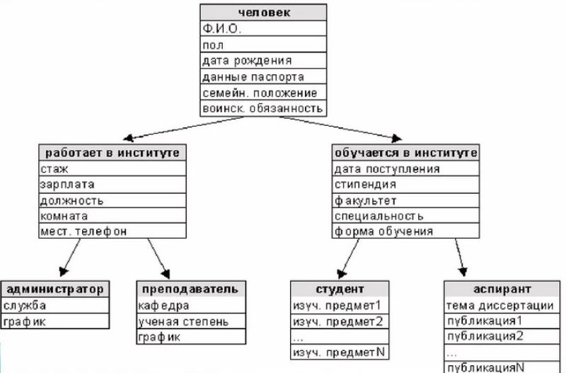

# Модуль 1. Эволюция подходов к хранению данных

## Исторические аспекты

Исторические аспекты - линейный текст, изустное распространение и обработка
данных. В линейном тексте содержание раскрывается последовательно и связно,
"по порядку", от начала к концу; он так и читается - от начала до конца,
целиком. Примерами таких текстов являются, например, сказки:

> Жили-были дед да баба. И была у них Курочка Ряба.
> Снесла курочка яичко, да не простое — золотое.
> Дед бил — не разбил.
> Баба била — не разбила.
> А мышка бежала, хвостиком махнула, яичко упало и разбилось.
> Плачет дед, плачет баба и говорит им Курочка Ряба:
> — Не плачь, дед, не плачь, баба: снесу вам новое яичко не золотое, а простое!

На самом деле это - сокращенный вариант, адаптированный для современных детей.
Ученые пытаются  разгадать, какой смысл вкладывался в подобные рассказы нам,
жителям XXI века зачастую не совсем понятные. Кто-то приписывает им
иносказательное описание модели Вселенной, кто-то руководство для бытовых нужд.
Нам же важно то, что сказка, предание, молитва и  другие подобные тексты
всегда рассказывалась от начала к концу. Перевирание порядка даже
приравнивалось к греху, некоторые считали, что если произнести молитву "задом
наперед", то случится что-то плохое, сработает черная магия или придут темные
силы.

Подобный подход до сих пор сохраняется в традиционнызх обществах, типичным
время провождением которых являются посиделки вокруг костра, где
рассказчики пересказывают по сто раз слышанные  истории. Подомное можно
встретить и в современном обществе в сходных ситуациях. Так, в компании 
рыбаков запросто могут попросить какого нибуть "Петровича" в сотый раз
рассказать как он "от рыбнадзора ушел". Похожий характер "сказок" носят и
лекции в учебных заведениях, где преподаватели стараются придерживаться ими же
установленного "канона".

Такой подход способствует запоминанию материала, возможно что он связан с
таким навыком выживания, как запоминание пути при следовании по малознакомой
местности. Ассоциация повествования  с движением, скорее всего, не случайна.
Однако такой подход не лишен и недостатков,  особенно в новейшее время.
Информации становится больше, отдельный чедовек уже не вмещает все знания,
доступные цивилизации, как было в прошлом. Поэтому приходится изобретать
способы быстрой передачи краткого содержания текста.

Так были предложены такие подходы как:

- денотатный граф,
- фреймовая модель.

## Денотатный граф 
Денотатный граф [от лат. denoto—обозначаю и греч. пишу] способ вычленения
существенных признаков ключевого понятия. Существуют  такие виды денотатных
графов: положительные при выстраивании позитивных характеристик и
отрицательные - их антиподы.

Примеры:

Надо сказать, что описания и определения графов, которые можно встретить в
методической литературе часто являются свидетельствами полного непонимания
того, что это такое и зачем нужно. Например тут
http://didaktor.ru/texnologicheskij-priyom-denotatnyj-graf/ автор говорит о
"глаголах" и "существительных", хотя они вообще относятся к другому уровню
модели языка.

На самом деле такой граф - способ эксплицитного представления внутренней
содержательной формы текста,  не привязанный к обычным языковым (лексическому,
синтаксическому и т.п.) способам выражения мысли. Денотатный граф не зависит
от используемого языка. Так, для понятия "компьютер" графы на русском или
английском языке будут идентичны при условии одинакового понимания их авторами
 самой сути этого явления.

## Фреймовая модель

Фреймы это структуры данных, в которых в определенном порядке
представлены сведения о свойствах объекта. Когда человек оказывается в
новой ситуации, он извлекает из памяти ранее накопленные  блоки 
знаний,  имеющие  отношение  к  текущей  ситуации,  и  пытается
применить их. Эти блоки знаний и представляют собой фреймы. Вероятно,
знания человека организованы в виде сети фреймов, отражающих его
прошлый опыт. Например:типовой номер в гостинице. Он имеет кровать,
ванную комнату, шкаф для одежды,  телефон  и  т.д.  Детали  каждого 
конкретного  номера  могут  отличаться  от приведенного описания. Но
они легко уточняются, когда человек оказывается в конкретном номере:
цвет обоев, положение выключателей. Таким образом, любое представление
о предмете, объекте, стереотипной ситуации  у  человека  всегда 
обрамлено  (отсюда frame–«рамка»)  характеристикамии свойствами
объекта или ситуации.Основной структурной единицей фрейма
является слот – вложенная во фрейм структура данных.

Слоты – это некоторые незаполненные подструктуры фрейма, после заполнения
которых конкретными данными, фрейм будет представлять ту или иную ситуацию,
явление или объект предметной области. При конкретизации фрейма ему и его
слотам присваиваются конкретные имена и происходит заполнение слотов. В
качестве значений слотов могут выступать имена других фреймов, что
обеспечивает построение сети фреймов 

Фреймовые модели реже используются на практике, т.к сложнее в построении.
Но часто их идеи неявно заимствуются при построении моделей денотатных.

Примеры:

# Модуль 2. Реляционная модель

# Модуль 3. Минимальная модель "Ключ-значение"

# Модуль 4. Документно-ориентированная модель 

# Модуль 5. Распределенные файловые системы вместо моделей данных: архитектура кластера [HDFS]

# Модуль 6. SQL поверх распределенных файловых систем

# Модуль 7. Распределенные системы хранения данных в оперативной памяти [Hazelcast, Ignite, Tarantool]

# Модуль 8. Распределенные OLAP-системы [Clickhouse, Druid]

# Модуль 9. Обработка потоков данных [Spark Streaming]

# Модуль 10. Самонастраиваемые и автономные базы данных
