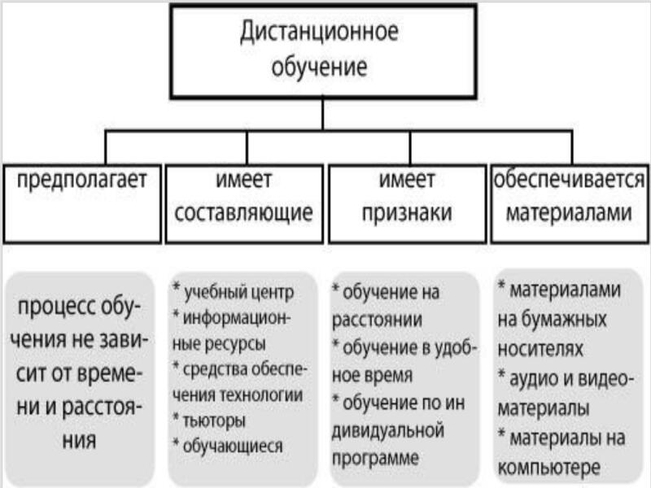
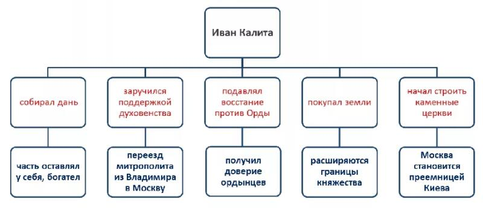
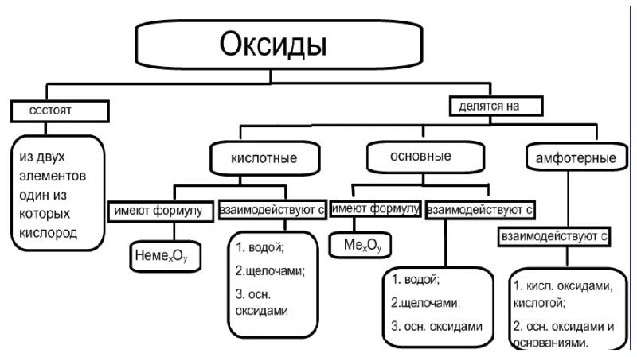

# Модуль 1. Эволюция подходов к хранению данных

Исторические аспекты - линейный текст, изустное распространение и обработка данных. В линейном тексте содержание раскрывается последовательно и связно, "по порядку", от начала к концу; он так и читается - от начала до конца, целиком. Примерами таких текстов являются, например, сказки:

> Жили-были дед да баба. И была у них Курочка Ряба.
> 
> Снесла курочка яичко, да не простое — золотое.
> 
> Дед бил — не разбил.
> 
> Баба била — не разбила.
> 
> А мышка бежала, хвостиком махнула, яичко упало и разбилось.
> 
> Плачет дед, плачет баба и говорит им Курочка Ряба:
> 
> — Не плачь, дед, не плачь, баба: снесу вам новое яичко не золотое, а простое!

На самом деле это - сокращенный вариант, адаптированный для современных детей. Ученые пытаются 
разгадать, какой смысл вкладывался в подобные рассказы нам, жителям XXI века зачастую
не совсем понятные. Кто-то приписывает им нисказательное описание модели Вселенной,
кто-то руководство для бытовых нужд. Нам же важно то, что сказка, предание, молитва и 
другие подобные тексты всегда рассказывалась от начала к концу. Перевирание порядка
даже приравнивалось к греху, некоторые считали, что если произнести молитву
"задом наперед", то случится что-то плохое, сработает черная магия или придут темные силы.

Подобный подход до сих пор сохраняется в традиционнызх обществах, где типичным времяпровождением
племени-семья являются посиделки вокруг костра, где рассказчики пересказывают по 100 раз слышанные 
истории. Подомное можно встретить и в современном обществе в сходных ситуациях. Так, в компании 
рыбаков запросто могут поппросить какого-нить "Петровича" в сотый раз рассказать как он
"от рыбнадзора ушел". Похожий характер "сказок" носят и лекции в учебных заведениях,
где преподаватели стараются придерживаться ими же установленного "канона".

Такой подход способствует запоминанию материала, возможно что он связан с таким навыком
выживания, как запоминание пути при следовании по малознакомой местности. Ассоциация повествования 
с движением, скорее всего, не случайна. Однако такой подход не лишен и недостатков, 
особенно в новейшее время. Информации становится больше, отдельный чедовек уже не вмещает
все знания, доступные цивилизации, как было в прошлом. Поэтому приходится
изобретать способы быстрой передачи краткого содержания текста.

Так были предложены такие подходы как:

- денотатный граф,
- фреймовая модель.

## Денотатный граф 
Денотатный граф [от лат. denoto—обозначаю и греч. пишу] способ вычленения существенных признаков ключевого понятия. Существуют 
такие виды денотатных графов: положительные при выстраивании позитивных характеристик и отрицательные - их антиподы.

Примеры:

# Модуль 2. Реляционная модель

# Модуль 3. Минимальная модель "Ключ-значение"

# Модуль 4. Документно-ориентированная модель 

# Модуль 5. Распределенные файловые системы вместо моделей данных: архитектура кластера [HDFS]

# Модуль 6. SQL поверх распределенных файловых систем

# Модуль 7. Распределенные системы хранения данных в оперативной памяти [Hazelcast, Ignite, Tarantool]

# Модуль 8. Распределенные OLAP-системы [Clickhouse, Druid]

# Модуль 9. Обработка потоков данных [Spark Streaming]

# Модуль 10. Самонастраиваемые и автономные базы данных
